<div align="center">


</div>

<div align="center">

[](https://git.io/typing-svg)

</div>

---

## 🧠 About Me

```python
class RayanBabur:
    def __init__(self):
        self.name        = "Rayan Babur"
        self.title       = "AI/ML Engineer"
        self.company     = "AI 3D Scanning Solutions Inc."
        self.university  = "University of Sahiwal — BSSE, 8th Semester"
        self.location    = "Sahiwal, Punjab, Pakistan 🇵🇰"
        self.email       = "alrayanbabur@gmail.com"

    @property
    def current_focus(self) -> list[str]:
        return [
            "🤖  Agentic AI — Multi-agent LangGraph systems",
            "🦾  LLM Orchestration — Claude, GPT, Gemini 1.5",
            "🎬  Generative Content Automation — video, image, text",
            "⚡  High-Performance Python — async, uv, parallel execution",
            "🔍  AI for Social Good — fraud detection, medical diagnostics",
        ]

    @property
    def toolbox(self) -> dict:
        return {
            "agentic_ai":  ["LangGraph", "LangChain", "Claude", "GPT", "Gemini"],
            "ml_stack":    ["PyTorch", "TensorFlow", "Scikit-Learn", "HuggingFace"],
            "backend":     ["FastAPI", "PostgreSQL", "SQLite", "Redis"],
            "vision":      ["OpenCV", "PIL", "FFmpeg", "Gemini Vision"],
            "devops":      ["Docker", "GitHub Actions", "Heroku", "uv"],
            "languages":   ["Python", "TypeScript", "Dart", "HTML/CSS"],
        }

    def philosophy(self) -> str:
        return "Ship intelligent systems that actually work in production. 🚀"
```

---

## ⚙️ Tech Arsenal

<div align="center">

**Languages**

[](https://skillicons.dev)

**AI / ML / Agentic**

[](https://skillicons.dev)


**Backend & DevOps**

[](https://skillicons.dev)


**Tools**

[](https://skillicons.dev)

</div>

---

## 🚀 Featured Projects

<table>
  <tr>
    <td width="50%" valign="top">
      <h3>🤖 <a href="https://github.com/RayanBabar/validator-ai">validator-ai</a></h3>
      <p>Sophisticated <strong>agentic AI system</strong> for validating startup ideas using <strong>LangGraph</strong>. Orchestrates multiple LLMs (Claude + GPT) across interview, market research, and scoring agents. Features a self-healing "compiler" agent and investor-grade report generation.</p>
      <p>
        
        
        
      </p>
    </td>
    <td width="50%" valign="top">
      <h3>🎬 <a href="https://github.com/RayanBabar/short_generation">short_generation</a></h3>
      <p>AI-powered <strong>YouTube Shorts generator</strong> using Gemini 1.5 Flash. Converts long-form videos into viral shorts by intelligently identifying hooks, optimizing context windows, and achieving <strong>95% audio compression</strong> via FFmpeg.</p>
      <p>
        
        
        
      </p>
    </td>
  </tr>
  <tr>
    <td width="50%" valign="top">
      <h3>🏠 <a href="https://github.com/RayanBabar/decor-ai">decor-ai</a></h3>
      <p><strong>AI interior design assistant</strong> powered by Gemini Vision + FastAPI. Analyzes room images to detect decor items, generate design suggestions, and serve recommendations through a clean REST API — all via multimodal LLM reasoning.</p>
      <p>
        
        
        
      </p>
    </td>
    <td width="50%" valign="top">
      <h3>🔍 <a href="https://github.com/RayanBabar/expenseai">expenseai</a></h3>
      <p><strong>Government fraud detection system</strong> for welfare schemes. Uses FastAPI + Scikit-Learn to automate eligibility checks, compute dynamic trust scores, and flag anomalies — with a <strong>multilingual AI chatbot</strong> for citizen queries.</p>
      <p>
        
        
        
      </p>
    </td>
  </tr>
  <tr>
    <td width="50%" valign="top">
      <h3>🏥 <a href="https://github.com/RayanBabar/multiple_disease_prediction">multiple_disease_prediction</a></h3>
      <p>Interactive <strong>disease prediction dashboard</strong> for Diabetes, Heart Disease, and Parkinson's — built with Streamlit and multiple Scikit-Learn classifiers. Deployed to Heroku for public access.</p>
      <p>
        
        
        
      </p>
    </td>
    <td width="50%" valign="top">
      <h3>🧬 <a href="https://github.com/RayanBabar/LLM-Finetuning">LLM-Finetuning</a></h3>
      <p>Research notebooks and scripts for <strong>fine-tuning Large Language Models</strong>. Experiments with PEFT techniques, LoRA adapters, and custom training pipelines for domain-specific LLM adaptation.</p>
      <p>
        
        
        
      </p>
    </td>
  </tr>
</table>

---

## 📊 GitHub Stats

<div align="center">

<a href="https://github.com/RayanBabar">
  
</a>
&nbsp;&nbsp;
<a href="https://github.com/RayanBabar">
  
</a>

</div>

<div align="center">

[](https://git.io/streak-stats)

</div>

<div align="center">

[](https://github.com/ashutosh00710/github-readme-activity-graph)

</div>

---

## 🏆 GitHub Trophies

<div align="center">

[](https://github.com/ryo-ma/github-profile-trophy)

</div>

---

## 🐍 Contribution Graph

<div align="center">

<picture>
  <source media="(prefers-color-scheme: dark)" srcset="https://raw.githubusercontent.com/RayanBabar/RayanBabar/output/github-contribution-grid-snake-dark.svg">
  <source media="(prefers-color-scheme: light)" srcset="https://raw.githubusercontent.com/RayanBabar/RayanBabar/output/github-contribution-grid-snake.svg">
  
</picture>

</div>

---

## 📜 Certifications

<div align="center">

| 🏅 Certification | 🏛️ Issuer |
|:--|:--|
| Fundamentals of Accelerated Computing with CUDA Python | NVIDIA |
| AI Neural Insights: Deep Learning with Python | Udemy |
| ChatGPT Prompt Engineering for Developers | DeepLearning.AI |
| JavaScript Algorithms and Data Structures | freeCodeCamp |
| Agile Community Rules Classification | Jigsaw |

</div>

---

## 🤝 Connect With Me

<div align="center">

[](https://www.linkedin.com/in/rayan-babur-7a1686252/)
[](mailto:alrayanbabur@gmail.com)
[](https://github.com/RayanBabar)

</div>

---

<div align="center">

[](https://hits.sh/github.com/RayanBabar/)


</div>
